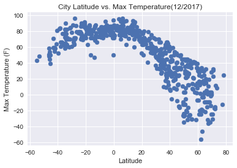
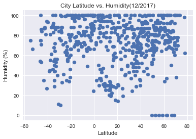
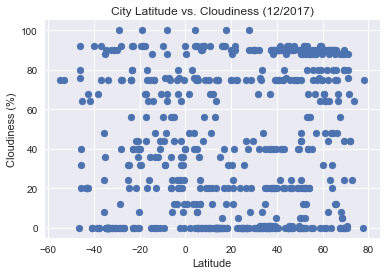
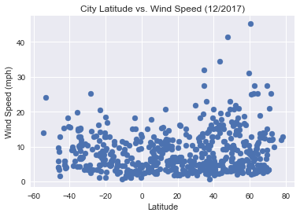

Analysis
Observable trend1:
    From City Latitude vs. Max Temperature(12/2017), we can tell that the cities which are closed to equator have
    higher temperature.  
    
Observable trend2:
    From City Latitude vs. Humidity(12/2017), we can tell that equator has nothing to do with a city's humidity.
    From City Latitude vs. Cloudiness (12/2017), we can tell that equator has nothing to do with a city's Cloudiness.
Observable trend3:
    From City Latitude vs. Wind Speed (12/2017), we can tell that equator has nothing to do with a city's Wind Speed.
    


```python
# Temperature (F) vs. Latitude
# Humidity (%) vs. Latitude
# Cloudiness (%) vs. Latitude
# Wind Speed (mph) vs. Latitude
```


```python
import json
import requests as req
import random
from citipy import citipy
import pandas as pd
import seaborn as sns
import matplotlib.pyplot as plt
```


```python
api_key = 'f3931189c225f49685f8c7d815baa5a5'
url = 'http://api.openweathermap.org/data/2.5/weather?'
units = "Imperial" 
```


```python
query_url = url + "appid=" + api_key + "&units=" + units + "&q="
query_url
```


    'http://api.openweathermap.org/data/2.5/weather?appid=f3931189c225f49685f8c7d815baa5a5&units=Imperial&q='


```python
lats = []
for x in range(1500):
    lats.append(random.uniform(-180,180))

lons = []
for x in range(1500):
    lons.append(random.uniform(-90,90))
    
cities = []
for x in range(1500):
    city = citipy.nearest_city(lons[x], lats[x]).city_name
    cities.append(city)
#city.country_code
#cities
```


```python
weather_data = []

for city in cities:
    weather_data.append(req.get(query_url + city).json())

#weather_data
```


```python
allcity = [data.get('name') for data in weather_data]
cloudiness = [data.get('clouds') for data in weather_data]
country = [data.get('sys') for data in weather_data]
date = [data.get('dt') for data in weather_data]
humidity = [data.get('main') for data in weather_data]
coord = [data.get('coord') for data in weather_data]
max_temp = [data.get('main') for data in weather_data]
wind_speed = [data.get("wind") for data in weather_data]
```


```python
weather_data1 = {"City": allcity,
                "Cloudiness": cloudiness, 
                "Country": country, 
                "Date": date, 
                "Humidity": humidity, 
                "Coord": coord, 
                "Max Temp": max_temp, 
                "Wind Speed": wind_speed}
weather_data1 = pd.DataFrame(weather_data1)
weather_data1.dropna().head()
```


<div>
<style>
    .dataframe thead tr:only-child th {
        text-align: right;
    }

    .dataframe thead th {
        text-align: left;
    }

    .dataframe tbody tr th {
        vertical-align: top;
    }
</style>
<table border="1" class="dataframe">
  <thead>
    <tr style="text-align: right;">
      <th></th>
      <th>City</th>
      <th>Cloudiness</th>
      <th>Coord</th>
      <th>Country</th>
      <th>Date</th>
      <th>Humidity</th>
      <th>Max Temp</th>
      <th>Wind Speed</th>
    </tr>
  </thead>
  <tbody>
    <tr>
      <th>1</th>
      <td>Ponta do Sol</td>
      <td>{'all': 0}</td>
      <td>{'lon': -46, 'lat': -20.63}</td>
      <td>{'message': 0.0039, 'country': 'BR', 'sunrise'...</td>
      <td>1.514297e+09</td>
      <td>{'temp': 84.69, 'pressure': 924.86, 'humidity'...</td>
      <td>{'temp': 84.69, 'pressure': 924.86, 'humidity'...</td>
      <td>{'speed': 6.4, 'deg': 37.501}</td>
    </tr>
    <tr>
      <th>2</th>
      <td>Bluff</td>
      <td>{'all': 80}</td>
      <td>{'lon': 149.07, 'lat': -23.58}</td>
      <td>{'message': 0.0039, 'country': 'AU', 'sunrise'...</td>
      <td>1.514297e+09</td>
      <td>{'temp': 77.44, 'pressure': 1002.19, 'humidity...</td>
      <td>{'temp': 77.44, 'pressure': 1002.19, 'humidity...</td>
      <td>{'speed': 11.65, 'deg': 43.501}</td>
    </tr>
    <tr>
      <th>3</th>
      <td>Vaini</td>
      <td>{'all': 0}</td>
      <td>{'lon': 74.49, 'lat': 15.34}</td>
      <td>{'message': 0.0042, 'country': 'IN', 'sunrise'...</td>
      <td>1.514297e+09</td>
      <td>{'temp': 74.38, 'pressure': 961.66, 'humidity'...</td>
      <td>{'temp': 74.38, 'pressure': 961.66, 'humidity'...</td>
      <td>{'speed': 6.06, 'deg': 76.501}</td>
    </tr>
    <tr>
      <th>4</th>
      <td>Severo-Kurilsk</td>
      <td>{'all': 48}</td>
      <td>{'lon': 156.12, 'lat': 50.68}</td>
      <td>{'message': 0.003, 'country': 'RU', 'sunrise':...</td>
      <td>1.514297e+09</td>
      <td>{'temp': 29.56, 'pressure': 990.28, 'humidity'...</td>
      <td>{'temp': 29.56, 'pressure': 990.28, 'humidity'...</td>
      <td>{'speed': 16.58, 'deg': 193.001}</td>
    </tr>
    <tr>
      <th>5</th>
      <td>Severo-Kurilsk</td>
      <td>{'all': 48}</td>
      <td>{'lon': 156.12, 'lat': 50.68}</td>
      <td>{'message': 0.003, 'country': 'RU', 'sunrise':...</td>
      <td>1.514297e+09</td>
      <td>{'temp': 29.56, 'pressure': 990.28, 'humidity'...</td>
      <td>{'temp': 29.56, 'pressure': 990.28, 'humidity'...</td>
      <td>{'speed': 16.58, 'deg': 193.001}</td>
    </tr>
  </tbody>
</table>
</div>


```python
allcity2 = weather_data1.dropna()['City'].tolist()
cloudiness2 = [data.get('all') for data in weather_data1.dropna()['Cloudiness'].tolist()]
country2 = [data.get('country') for data in weather_data1.dropna()['Country'].tolist()]
date2 = weather_data1.dropna()['Date'].tolist()
humidity2 = [data.get('humidity') for data in weather_data1.dropna()['Humidity'].tolist()]
lon2 = [data.get('lon') for data in weather_data1.dropna()['Coord'].tolist()]
lat2 = [data.get('lat') for data in weather_data1.dropna()['Coord'].tolist()]
max_temp2 = [data.get('temp_max') for data in weather_data1.dropna()['Max Temp'].tolist()]
wind_speed2 = [data.get("speed") for data in weather_data1.dropna()['Wind Speed'].tolist()]
```


```python
weather_data2 = {"City": allcity2,
                "Cloudiness": cloudiness2, 
                "Country": country2, 
                "Date": list(map(int, date2)), 
                "Humidity": humidity2, 
                "Lat": lat2,
                "Lng": lon2, 
                "Max Temp": max_temp2, 
                "Wind Speed": wind_speed2}
weather_data2 = pd.DataFrame(weather_data2)
weatherpy = weather_data2.drop_duplicates(['City'], keep = 'last')
weatherpy.head()
```


<div>
<style>
    .dataframe thead tr:only-child th {
        text-align: right;
    }

    .dataframe thead th {
        text-align: left;
    }

    .dataframe tbody tr th {
        vertical-align: top;
    }
</style>
<table border="1" class="dataframe">
  <thead>
    <tr style="text-align: right;">
      <th></th>
      <th>City</th>
      <th>Cloudiness</th>
      <th>Country</th>
      <th>Date</th>
      <th>Humidity</th>
      <th>Lat</th>
      <th>Lng</th>
      <th>Max Temp</th>
      <th>Wind Speed</th>
    </tr>
  </thead>
  <tbody>
    <tr>
      <th>5</th>
      <td>Kandrian</td>
      <td>36</td>
      <td>PG</td>
      <td>1514296982</td>
      <td>100</td>
      <td>-6.21</td>
      <td>149.55</td>
      <td>74.97</td>
      <td>2.93</td>
    </tr>
    <tr>
      <th>7</th>
      <td>Rawlins</td>
      <td>90</td>
      <td>US</td>
      <td>1514294100</td>
      <td>79</td>
      <td>41.79</td>
      <td>-107.24</td>
      <td>24.80</td>
      <td>14.99</td>
    </tr>
    <tr>
      <th>13</th>
      <td>Kuyanovo</td>
      <td>88</td>
      <td>RU</td>
      <td>1514296986</td>
      <td>88</td>
      <td>56.95</td>
      <td>86.47</td>
      <td>20.65</td>
      <td>18.59</td>
    </tr>
    <tr>
      <th>14</th>
      <td>Beringovskiy</td>
      <td>24</td>
      <td>RU</td>
      <td>1514296987</td>
      <td>100</td>
      <td>63.05</td>
      <td>179.32</td>
      <td>-3.20</td>
      <td>8.41</td>
    </tr>
    <tr>
      <th>15</th>
      <td>Oleksandrivka</td>
      <td>20</td>
      <td>UA</td>
      <td>1514296988</td>
      <td>95</td>
      <td>48.74</td>
      <td>37.49</td>
      <td>39.19</td>
      <td>9.86</td>
    </tr>
  </tbody>
</table>
</div>


```python
weatherpy.to_csv('WeatherPy.csv', sep='\t')
```


```python
# Temperature (F) vs. Latitude
```


```python
plt.scatter(weatherpy["Lat"], weatherpy["Max Temp"], marker="o")

plt.title("City Latitude vs. Max Temperature(12/2017)")
plt.ylabel("Max Temperature (F)")
plt.xlabel("Latitude")
plt.grid(True)

# Save the figure
plt.savefig("CityLatitudevsMaxTemperature122017.png")

# Show plot
sns.set()
plt.show()
```





```python
# Humidity (%) vs. Latitude
```


```python
plt.scatter(weatherpy["Lat"], weatherpy["Humidity"], marker="o")

plt.title("City Latitude vs. Humidity(12/2017)")
plt.ylabel("Humidity (%)")
plt.xlabel("Latitude")
plt.grid(True)

# Save the figure
plt.savefig("CityLatitudevsHumidity122017.png")

# Show plot
sns.set()
plt.show()
```





```python
# Cloudiness (%) vs. Latitude
```


```python
plt.scatter(weatherpy["Lat"], weatherpy["Cloudiness"], marker="o")

plt.title("City Latitude vs. Cloudiness (12/2017)")
plt.ylabel("Cloudiness (%)")
plt.xlabel("Latitude")
plt.grid(True)

# Save the figure
plt.savefig("CityLatitudevsCloudiness122017.png")

# Show plot
sns.set()
plt.show()
```





```python
# Wind Speed (mph) vs. Latitude
```


```python
plt.scatter(weatherpy["Lat"], weatherpy["Wind Speed"], marker="o")

plt.title("City Latitude vs. Wind Speed (12/2017)")
plt.ylabel("Wind Speed (mph)")
plt.xlabel("Latitude")
plt.grid(True)

# Save the figure
plt.savefig("CityLatitudevsWindSpeed122017.png")

# Show plot
sns.set()
plt.show()
```




